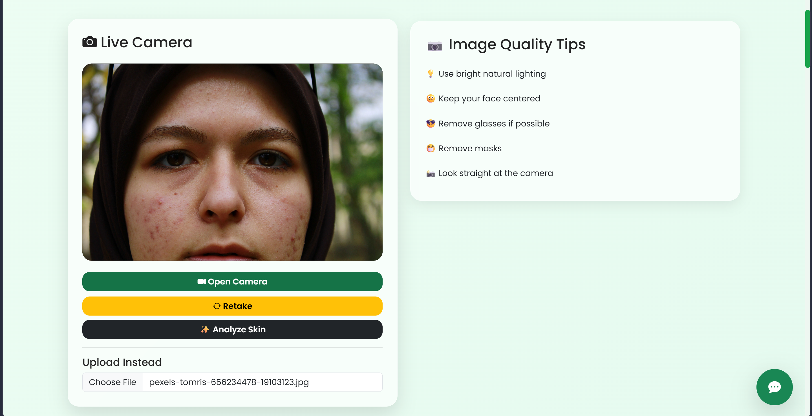
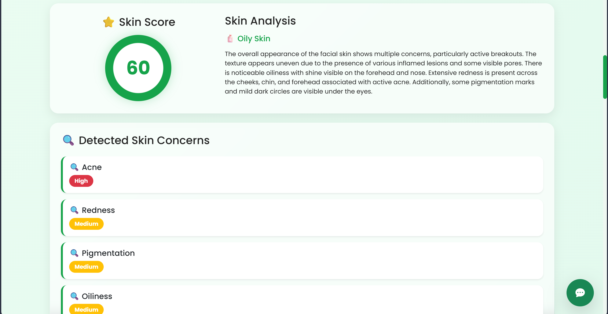
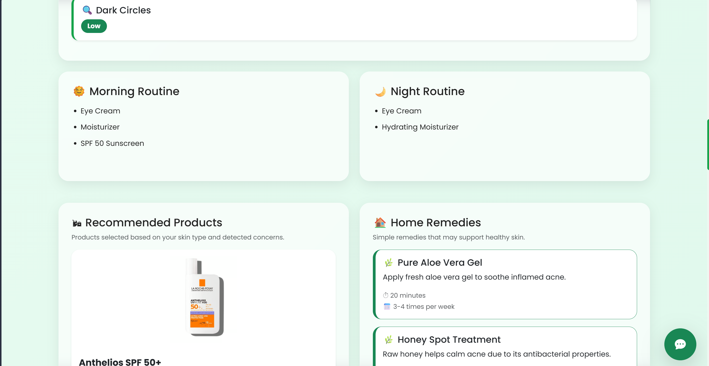
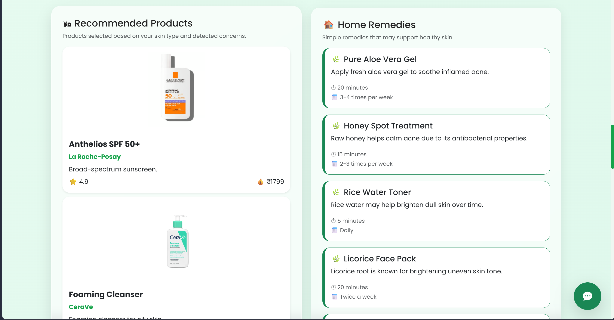
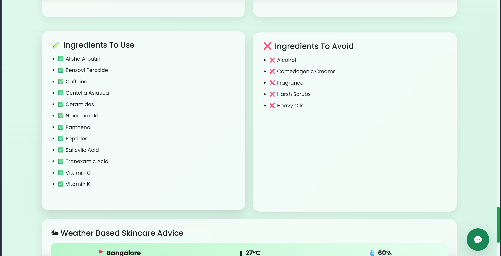
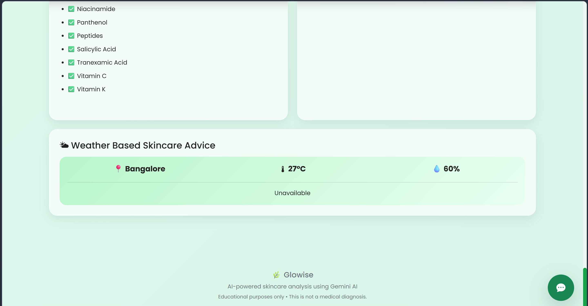
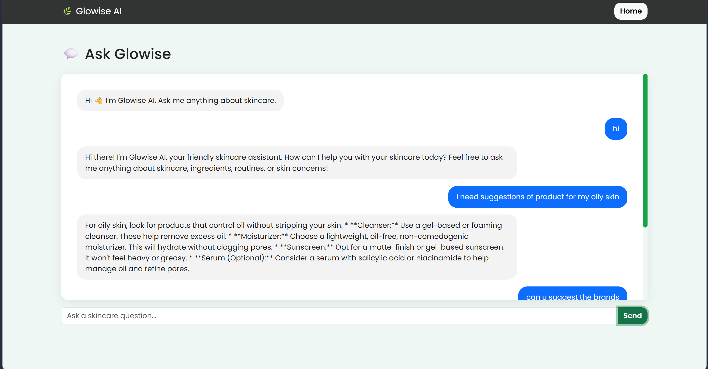
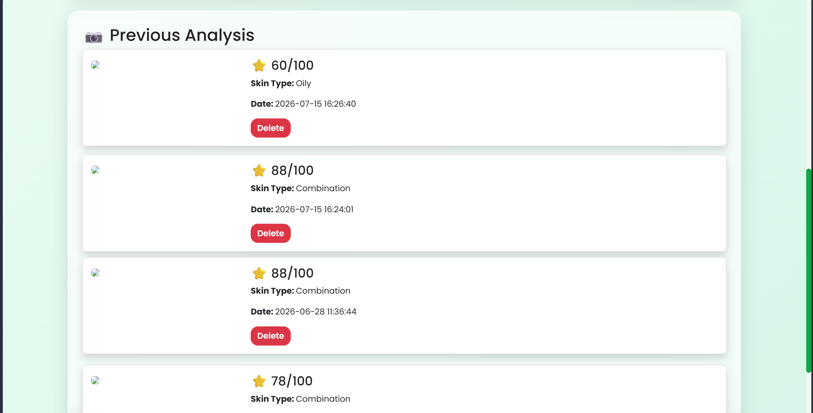
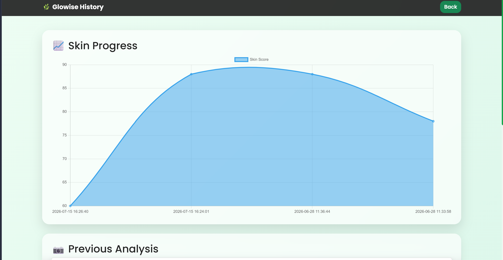

# 🌿 Glowise

> AI-powered skincare analysis platform built with Flask and Google Gemini AI.

Glowise is a full-stack web application that analyzes facial skin images using **Google Gemini AI** and provides personalized skincare recommendations. Users can upload a facial image or capture one using their webcam to receive an AI-generated skin assessment, customized skincare routines, product recommendations, home remedies, weather-aware skincare advice, and an interactive skincare chatbot.

---

## ✨ Features

- 📷 Upload or capture facial images using webcam
- 🤖 AI-powered skin analysis using Google Gemini
- 💯 Skin score generation
- 🧴 Skin type detection (Oily, Dry, Combination, Sensitive, etc.)
- 🔍 Detection of common skin concerns
  - Acne
  - Pigmentation
  - Redness
  - Oiliness
  - Dark Circles
- 🌞 Personalized morning skincare routine
- 🌙 Personalized night skincare routine
- 🛍️ Product recommendations based on skin type
- 🌿 Natural home remedies
- 🧪 Ingredients to use and avoid
- 🌦️ Weather-based skincare advice
- 💬 AI skincare chatbot
- 📈 Skin analysis history with progress tracking
- 🗑️ Manage previous analyses

---

## 🛠 Tech Stack

### Backend
- Python
- Flask
- SQLite

### Frontend
- HTML5
- CSS3
- JavaScript

### APIs & AI
- Google Gemini API
- Weather API

---

## 📸 Application Screenshots

### 🏠 Home Page



---

### 🤖 AI Skin Analysis



---

### 🌞 Personalized Skincare Routine



---

### 🛍️ Product Recommendations & Home Remedies



---

### 🧪 Ingredients & Weather-Based Advice





---

### 💬 AI Chat Assistant



---

### 📈 Skin Progress Dashboard



---

### 📚 Previous Analysis History



---

## 🚀 Installation

### Clone the repository

```bash
git clone https://github.com/Pragnya-Muchalambe/Glowise.git
```

### Navigate to the project

```bash
cd Glowise
```

### Install dependencies

```bash
pip install -r requirements.txt
```

### Configure environment variables

Create a `.env` file in the project root.

```env
GEMINI_API_KEY=your_api_key_here
WEATHER_API_KEY=your_api_key_here
```

### Run the application

```bash
python app.py
```

Open your browser and visit:

```
http://127.0.0.1:5000
```

---

## 📂 Project Structure

```
Glowise/
│
├── data/
├── database/
├── screenshots/
├── services/
├── static/
├── templates/
├── uploads/
├── app.py
├── config.py
├── database.py
├── requirements.txt
├── README.md
└── .env.example
```

---

## 🔮 Future Improvements

- User authentication
- Cloud image storage
- Email reports
- Mobile responsiveness
- Dermatologist appointment integration
- Multi-language support
- Skin progress analytics

---

## 👩‍💻 Author

**Pragnya Muchalambe**

GitHub: https://github.com/Pragnya-Muchalambe

---

## ⭐ Support

If you found this project helpful, consider giving it a ⭐ on GitHub!